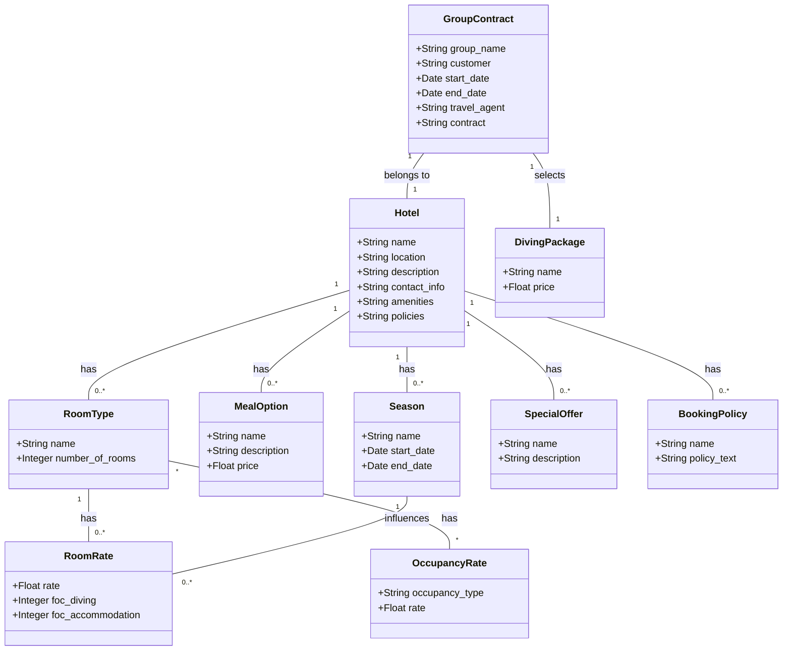

# Backend for Group Contract Builder

This project is the backend for a Group Contract Builder application, built using FastAPI. It manages complex data models, including Hotels, Room Types, Occupancy Rates, Room Rates, Meal Options, Seasons, Diving Packages, Special Offers, Booking Policies, and Group Contracts.

## Project Structure

The backend project is structured as follows:

- `app/`: Main application folder.
  - `users/`: User-related modules.
  - `contracts/`: Contract-related modules.
  - `core/`: Core application modules.
    - `config/`: Configuration settings.
    - `security/`: Security and authentication.
  - `db/`: Database-related modules.
    - `base_class/`: Base class for SQLAlchemy models.
    - `session/`: Database session management.
  - `dependencies.py`: Dependencies for FastAPI routes.
  - `main.py`: Main FastAPI application file.
- `tests/`: Test cases for the application.

## Getting Started

To get started with the development server, follow these steps:

### Prerequisites

Ensure you have the following installed:
- Python 3.8 or higher
- FastAPI
- Uvicorn

### Installation

1. Clone the repository: ```git clone https://github.com/spizeck/SeaSabaBackend```
2. Navigate to the backend directory: ```cd path/to/backend```
3. Install the required packages: ```pip install -r requirements.txt```

   
### Running the Development Server

To start the FastAPI development server, run: ```uvicorn app.main:app --reload```

The `--reload` flag enables auto-reloading of the server upon changes to the code.

### Accessing the API Documentation

Once the server is running, you can access the API documentation (auto-generated by FastAPI) by navigating to:

`http://localhost:8000/docs`

## Contributing

Contributions to this project are welcome. Please ensure that any pull requests or changes adhere to the existing project structure and coding standards.

## License

MIT License

Copyright (c) 2023 Chad Nuttall

Permission is hereby granted, free of charge, to any person obtaining a copy of this software and associated documentation files (the "Software"), to deal in the Software without restriction, including without limitation the rights to use, copy, modify, merge, publish, distribute, sublicense, and/or sell copies of the Software, and to permit persons to whom the Software is furnished to do so, subject to the following conditions:

The above copyright notice and this permission notice shall be included in all copies or substantial portions of the Software.

THE SOFTWARE IS PROVIDED "AS IS", WITHOUT WARRANTY OF ANY KIND, EXPRESS OR IMPLIED, INCLUDING BUT NOT LIMITED TO THE WARRANTIES OF MERCHANTABILITY, FITNESS FOR A PARTICULAR PURPOSE AND NONINFRINGEMENT. IN NO EVENT SHALL THE AUTHORS OR COPYRIGHT HOLDERS BE LIABLE FOR ANY CLAIM, DAMAGES OR OTHER LIABILITY, WHETHER IN AN ACTION OF CONTRACT, TORT OR OTHERWISE, ARISING FROM, OUT OF OR IN CONNECTION WITH THE SOFTWARE OR THE USE OR OTHER DEALINGS IN THE SOFTWARE.


## Contact

Chad Nuttall - chadnuttall1@gmail.com

## Data Model Visualization

To help visualize the relationships between different entities in our application, we have created a Mermaid chart. This chart illustrates how various models like `Hotel`, `RoomType`, `OccupancyRate`, `RoomRate`, `MealOption`, `Season`, `DivingPackage`, `SpecialOffer`, `BookingPolicy`, and `GroupContract` are interconnected. It serves as a useful reference for understanding the structure and relations of our data models.

### Mermaid Chart

Below is the Mermaid chart showing the relationships among our models:


